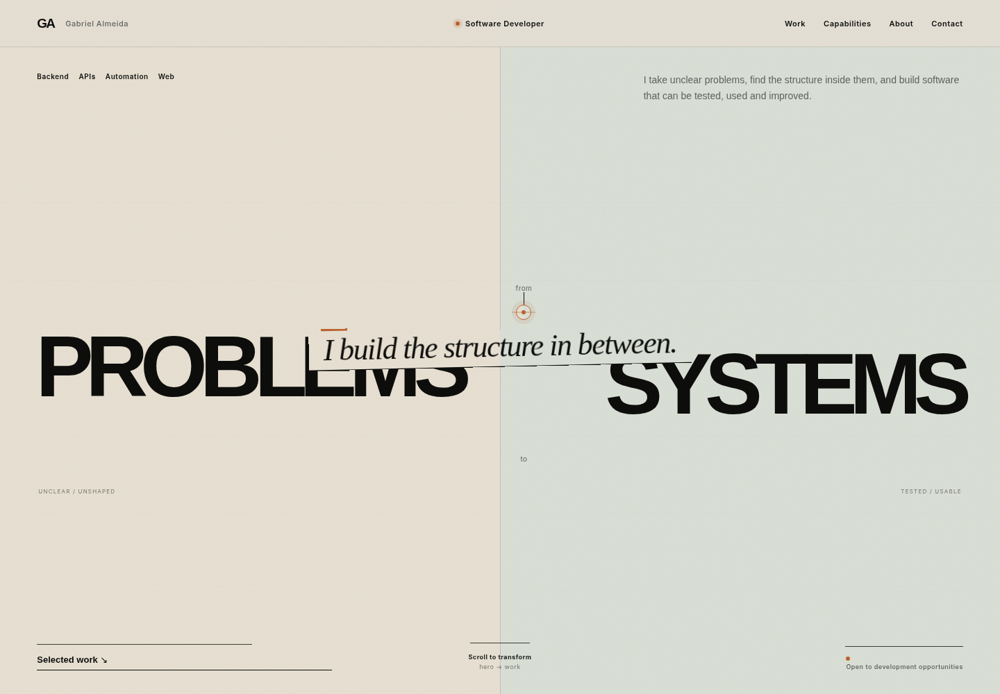
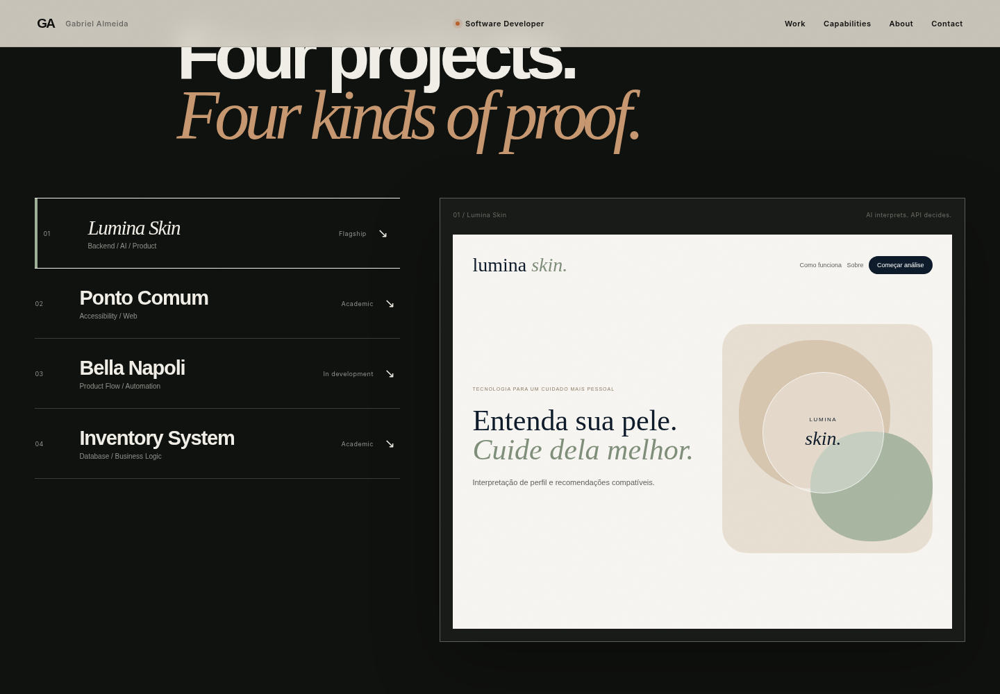

# Gabriel Almeida — Portfolio

Personal portfolio of **Gabriel Almeida**, Software Developer focused on **Backend, APIs, Automation and Web**.

> **Problems → Structure → Systems**  
> I build the structure in between.



---

## About the project

This portfolio was designed to present my work to recruiters, developers, companies and people interested in the projects I build.

Instead of following the usual developer-portfolio aesthetic, the site uses an **editorial and system-driven visual language**. The main concept is based on the way I approach software development: taking unclear problems, finding structure inside them and turning that structure into working systems.

The experience is intentionally lightweight, responsive and built without a front-end framework.

---

## Highlights

- Custom editorial art direction
- Hero based on the concept **Problems → Systems**
- Scroll-driven Hero → Work structural transition
- Interactive Selected Work browser
- Four project case studies with distinct visual identities
- Interactive software architecture map
- Accessibility-focused interactive demo
- Responsive composition for desktop, tablet and mobile
- Keyboard-friendly navigation
- `prefers-reduced-motion` support
- Custom section and project transitions
- Bilingual résumé downloads: **English and PT-BR**
- Real portrait integrated into the final contact section
- No framework or UI component library

---

## Selected work

### 01 — Lumina Skin

AI-assisted skin analysis API and full-stack product.

The case study focuses on the separation between probabilistic AI interpretation and deterministic backend rules.

**Main technologies:** Python, FastAPI, Pydantic, SQLite, React, TypeScript, Vite, Pytest and GitHub Actions.

Repository:  
https://github.com/GabrielJalmeida/api-analise-pele

---

### 02 — Ponto Comum

Academic accessible-web project for a fictional NGO focused on people with visual and hearing disabilities.

The project explores semantic structure, keyboard navigation, accessibility preferences and inclusive interface design.

Repository:  
https://github.com/GabrielJalmeida/ponto-comum

---

### 03 — Bella Napoli

Ordering-system project currently in development.

The case presents the relationship between customer flow, backend state, database and operational tooling.

**Main technologies:** FastAPI, Pydantic, SQLAlchemy and PostgreSQL.

Repository:  
https://github.com/GabrielJalmeida/bella-napoli

---

### 04 — Inventory System

Inventory and database project focused on business rules, data modelling and stock logic.

The current direction is a solo rebuild with full ownership of the project.

---

## Preview



The portfolio is divided into visual chapters rather than repeating the same case-study template for every project. Each project uses a presentation style based on the kind of evidence it provides.

---

## Tech stack

### Core

- HTML5
- CSS3
- Vanilla JavaScript

### Browser APIs and techniques

- Intersection Observer
- `matchMedia`
- CSS custom properties
- CSS Grid and Flexbox
- Responsive typography with `clamp()`
- Reduced-motion fallbacks
- Semantic HTML and ARIA where appropriate

### Visual assets

- WebP
- SVG
- Google Fonts:
  - Archivo
  - Inter
  - Newsreader

There is **no build step** and no dependency installation required.

---

## Accessibility

Accessibility is part of the implementation rather than an afterthought.

The portfolio includes:

- Skip link
- Semantic navigation
- Visible keyboard focus
- Keyboard-compatible interactions
- Responsive navigation
- `prefers-reduced-motion` support
- Essential content that remains available without animation
- Accessible labels for interactive controls

The **Ponto Comum** case also contains an interactive accessibility demonstration with text-size, contrast and link-highlight controls.

---

## Project structure

```text
.
├── index.html
├── styles.css
├── script.js
│
├── assets/
│   ├── favicon.svg
│   ├── gabriel-contact.webp
│   ├── Gabriel-Almeida-Resume-EN.pdf
│   └── Gabriel-Almeida-Curriculo-PT-BR.pdf
│
├── previews/
│   └── ...
│
├── QA_REPORT.md
└── README.md
```

---

## Running locally

Clone the repository:

```bash
git clone https://github.com/GabrielJalmeida/portfolio-gabriel-almeida.git
cd portfolio-gabriel-almeida
```

You can open `index.html` directly in your browser.

For a local server:

```bash
python -m http.server 5500
```

Then open:

```text
http://localhost:5500
```

---

## Design direction

The portfolio was created around a few principles:

**Technology does not need to look like “technology”.**

The interface intentionally avoids common developer-portfolio clichés such as fake terminals, cyberpunk visuals, excessive glow, glassmorphism and generic technology icon grids.

Instead, the design uses:

- typography
- composition
- contrast
- project evidence
- structural motion
- different visual environments for each case

Motion is treated as part of the narrative. It should communicate **change of state, structure or context**, not simply make elements fade into view.

---

## Current version

**V6**

This version includes the complete desktop/mobile experience, four project chapters, capabilities, process, about, contact, bilingual résumés and the final contact composition.

---

## Contact

**Gabriel Almeida**  
Software Developer — Backend / APIs / Automation / Web

- Email: [gabrieljalmeida25@hotmail.com](mailto:gabrieljalmeida25@hotmail.com)
- LinkedIn: https://www.linkedin.com/in/gabriel-almeida-258453364/
- GitHub: https://github.com/GabrielJalmeida

---

<p align="center">
  <strong>Build things that work.</strong>
</p>
